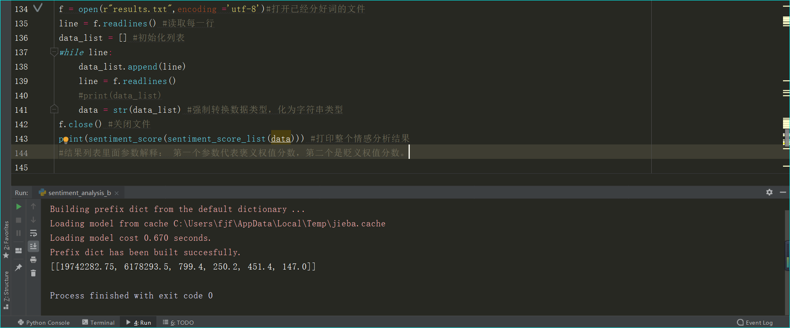

# Sentiment_analysis_car-comments
这个是对汽车之家口碑网某款车型的评论数据进行的情感分析，设计思路如下：
1）首先是编写网络爬虫，本次使用的是Scrapy框架，都知道汽车之家的网页是有很强的反爬机制的，一直在更新，不过最后获取到了数据。
2）进行数据处理，获取到口碑网评论数据后，对数据进行分词，去除停用词等操作
3）准备需要使用的情感词库，比如positive积极词等
4）编写完善代码对数据进行情感分析
5）编写产生词云的代码，方便直观看

下图是对单条数据进行的测试，第一个参数代表褒义情感权值，第二个参数代表贬义权值，可以看出，第一条到第四条都是褒义，第五条偏贬义。
 
 
 下图是对爬取下来的整个文件进行情感分析：可以看出这款车的评价都偏褒义，看来不错哦
  
  
  下图是对爬取下来的数据进行词云分析结果：外观，空间很重要啊
  
